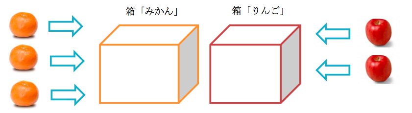
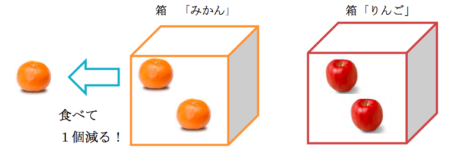
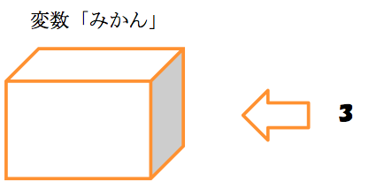
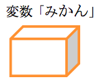
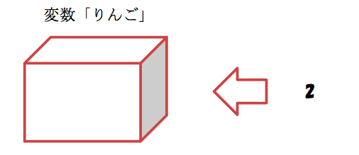
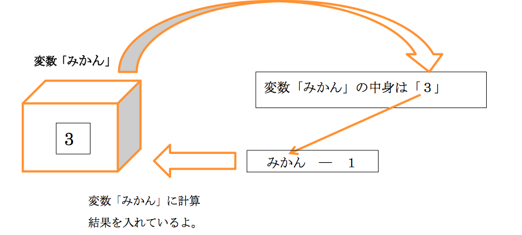
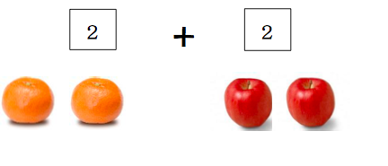

#<ruby><rb>第<rb><rt>だい</rt></ruby>４<ruby><rb>章<rb><rt>しょう</rt></ruby>：「<ruby><rb>変数<rb><rt>へんすう</rt></ruby>」ってなんだろう？

この<ruby><rb>章<rb><rt>しょう</rt></ruby>では<ruby><rb>次<rb><rt>つぎ</rt></ruby>のような<ruby><rb>事<rb><rt>こと</rt></ruby>が<ruby><rb>学<rb><rt>まな</rt></ruby>べるよ。

・<ruby><rb>変数<rb><rt>へんすう</rt></ruby>とは<ruby><rb>何<rb><rt>なに</rt></ruby>か<ruby><rb>身近<rb><rt>みぢか</rt></ruby>なたとえを<ruby><rb>用<rb><rt>もち</rt></ruby>いて<ruby><rb>お話<rb><rt>おはな</rt></ruby>しします。

・なぜ<ruby><rb>変数<rb><rt>へんすう</rt></ruby>というものが<ruby><rb>必要<rb><rt>ひつよう</rt></ruby>なのか<ruby><rb>分<rb><rt>わ</rt></ruby>かるようになります。

・<ruby><rb>変数<rb><rt>へんすう</rt></ruby>を<ruby><rb>使<rb><rt>つか</rt></ruby>って<ruby><rb>計算<rb><rt>けいさん</rt></ruby>をするプログラムがかけるようになります。

###まずはイメージをつかんでみよう！

<ruby><rb>例<rb><rt>れい</rt></ruby>：
<ruby><rb>太郎<rb><rt>たろう</rt></ruby><ruby><rb>君<rb><rt>くん</rt></ruby>はみかんとりんごを<ruby><rb>友達<rb><rt>ともだち</rt></ruby>からもらったので、<ruby><rb>箱<rb><rt>はこ</rt></ruby>を<ruby><rb>２<rb><rt>ふた</rt></ruby>つ<ruby><rb>用意<rb><rt>ようい</rt></ruby>しました。

もらったみかんとりんごを<ruby><rb>全部<rb><rt>ぜんぶ</rt></ruby><ruby><rb>手<rb><rt>て</rt></ruby>に<ruby><rb>持<rb><rt>も</rt></ruby>つのは<ruby><rb>大変<rb><rt>たいへん</rt></ruby>なので、 <ruby><rb>箱<rb><rt>ばこ</rt></ruby>に<ruby><rb>一旦<rb><rt>いったん</rt></ruby><ruby><rb>入<rb><rt>い</rt></ruby>れて<ruby><rb>数<rb><rt>かず</rt></ruby>を<ruby><rb>数<rb><rt>かぞ</rt></ruby>える<ruby><rb>事<rb><rt>こと</rt></ruby>にしました。

「みかん」という<ruby><rb>箱<rb><rt>はこ</rt></ruby>にみかんを３<ruby><rb>個<rb><rt>こ</rt></ruby><ruby><rb>入<rb><rt>い</rt></ruby>れ、 「りんご」という<ruby><rb>箱<rb><rt>はこ</rt></ruby>にりんごを２<ruby><rb>個<rb><rt>こ</rt></ruby><ruby><rb>入<rb><rt>い</rt></ruby>れました。　

しかし、<ruby><rb>太郎<rb><rt>たろう</rt></ruby><ruby><rb>君<rb><rt>くん</rt></ruby>はみかんを<ruby><rb>１<rb><rt>ひと</rt></ruby>つ<ruby><rb>食<rb><rt>た</rt></ruby>べてしまいました。

みかんの<ruby><rb>箱<rb><rt>はこ</rt></ruby>のみかんとりんごの<ruby><rb>箱<rb><rt>はこ</rt></ruby>のりんごを<ruby><rb>全部<rb><rt>ぜんぶ</rt></ruby>あわせると<ruby><rb>今<rb><rt>いま</rt></ruby><ruby><rb>現在<rb><rt>げんざい</rt></ruby>、<ruby><rb>合計<rb><rt>ごうけい</rt></ruby>何<ruby><rb>個<rb><rt>こ</rt></ruby>でしょうか？

<ruby><rb>答<rb><rt>こた</rt></ruby>え：４<ruby><rb>個<rb><rt>こ</rt></ruby>

<ruby><rb>最初<rb><rt>さいしょ</rt></ruby>はみかんの<ruby><rb>箱<rb><rt>はこ</rt></ruby>には３<ruby><rb>個<rb><rt>こ</rt></ruby>、りんごの<ruby><rb>箱<rb><rt>はこ</rt></ruby>には２<ruby><rb>個<rb><rt>こ</rt></ruby><ruby><rb>入<rb><rt>はい</rt></ruby>っているね。 プログラミングの<ruby><rb>世界<rb><rt>せかい</rt></ruby>ではこの<ruby><rb>箱<rb><rt>はこ</rt></ruby>のことを「<ruby><rb>変数<rb><rt>へんすう</rt></ruby>」と<ruby><rb>言<rb><rt>い</rt></ruby>うよ。

もらったみかんとりんごをずっと<ruby><rb>手<rb><rt>て</rt></ruby>に<ruby><rb>持<rb><rt>も</rt></ruby>っていては <ruby><rb>他<rb><rt>た</rt></ruby>の<ruby><rb>事<rb><rt>こと</rt></ruby>が<ruby><rb>出来<rb><rt>でき</rt></ruby>なくて<ruby><rb>不便<rb><rt>ふべん</rt></ruby>なので<ruby><rb>一旦<rb><rt>いったん</rt></ruby><ruby><rb>箱<rb><rt>はこ</rt></ruby>にしまうよね。 プログラミングでも<ruby><rb>同<rb><rt>おな</rt></ruby>じように<ruby><rb>変数<rb><rt>へんすう</rt></ruby>にものをしまうんだ。

<ruby><rb>現実<rb><rt>げんじつ</rt></ruby>には、みかんそのものを<ruby><rb>箱<rb><rt>はこ</rt></ruby>に<ruby><rb>入<rb><rt>い</rt></ruby>れているけど プログラミングはパソコン<ruby><rb>上<rb><rt>じょう</rt></ruby>で<ruby><rb>行<rb><rt>おこな</rt></ruby>うからみかんを<ruby><rb>箱<rb><rt>はこ</rt></ruby>に<ruby><rb>入<rb><rt>い</rt></ruby>れる<ruby><rb>事<rb><rt>こと</rt></ruby>はできないんだ。

だから、「みかんは○○<ruby><rb>個<rb><rt>こ</rt></ruby>あるよ」という”<ruby><rb>数字<rb><rt>すうじ</rt></ruby>”を<ruby><rb>変数<rb><rt>へんすう</rt></ruby>に<ruby><rb>入<rb><rt>い</rt></ruby>れるんだ。

みかんの<ruby><rb>箱<rb><rt>はこ</rt></ruby>にみかんを<ruby><rb>３<rb><rt>みっ</rt></ruby>つ<ruby><rb>入<rb><rt>い</rt></ruby>れる<ruby><rb>式<rb><rt>しき</rt></ruby>はプログラングではみかん＝３となるんだ。

ここでの「＝」は「<ruby><rb>同<rb><rt>おな</rt></ruby>じだよ」という<ruby><rb>意味<rb><rt>いみ</rt></ruby>ではなく、 “<ruby><rb>変数<rb><rt>へんすう</rt></ruby>「みかん」に「３」という<ruby><rb>数字<rb><rt>すうじ</rt></ruby>を<ruby><rb>入<rb><rt>い</rt></ruby>れるよ“という<ruby><rb>意味<rb><rt>いみ</rt></ruby>になるよ。

これで<ruby><rb>変数<rb><rt>へんすう</rt></ruby>「みかん」の<ruby><rb>中身<rb><rt>なかみ</rt></ruby>は「３」だから、
　　　　　
「３」　と　　　は<ruby><rb>同<rb><rt>おな</rt></ruby>じものとして<ruby><rb>考<rb><rt>かんが</rt></ruby>えることが<ruby><rb>出来<rb><rt>でき</rt></ruby>るんだよ。

<ruby><rb>同<rb><rt>おな</rt></ruby>じように、りんご=2とすると、<ruby><rb>変数<rb><rt>へんすう</rt></ruby>りんごに「2」を<ruby><rb>入<rb><rt>い</rt></ruby>れられるよ。

みかんを<ruby><rb>食<rb><rt>た</rt></ruby>べると<ruby><rb>箱<rb><rt>はこ</rt></ruby>からみかんが<ruby><rb>減<rb><rt>へ</rt></ruby>るように、<ruby><rb>変数<rb><rt>へんすう</rt></ruby>の<ruby><rb>中身<rb><rt>なかみ</rt></ruby>も<ruby><rb>変<rb><rt>か</rt></ruby>わっていくんだ。

っきみたいに、みかんの<ruby><rb>箱<rb><rt>はこ</rt></ruby>からみかんが１<ruby><rb>個<rb><rt>こ</rt></ruby><ruby><rb>減<rb><rt>へ</rt></ruby>ったときは、 プログラミングでは、 みかん=みかん-1 という<ruby><rb>式<rb><rt>しき</rt></ruby>であらわせるよ。

これをすると、”<ruby><rb>変数<rb><rt>へんすう</rt></ruby>「みかん」-１”すなわち”３－１”の<ruby><rb>結果<rb><rt>けっか</rt></ruby>の “２”が<ruby><rb>新<rb><rt>あたら</rt></ruby>しい<ruby><rb>変数<rb><rt>へんすう</rt></ruby>「みかん」の<ruby><rb>中身<rb><rt>なかみ</rt></ruby>になるね。

<ruby><rb>最後<rb><rt>さいご</rt></ruby>に<ruby><rb>箱<rb><rt>はこ</rt></ruby>の<ruby><rb>中身<rb><rt>なかみ</rt></ruby>を<ruby><rb>足し算<rb><rt>たしざん</rt></ruby>してみよう！

みんなが<ruby><rb>実際<rb><rt>じっさい</rt></ruby>に<ruby><rb>数<rb><rt>かず</rt></ruby>を<ruby><rb>数<rb><rt>かぞ</rt></ruby>える<ruby><rb>時<rb><rt>とき</rt></ruby>は、 “（みかんの<ruby><rb>箱<rb><rt>はこ</rt></ruby>の）２<ruby><rb>個<rb><rt>こ</rt></ruby><ruby><rb>＋<rb><rt>たす</rt></ruby>（リンゴの<ruby><rb>箱<rb><rt>はこ</rt></ruby>の）２<ruby><rb>個<rb><rt>こ</rt></ruby>”というように<ruby><rb>数字<rb><rt>すうじ</rt></ruby>で<ruby><rb>計算<rb><rt>けいさん</rt></ruby>するよね。

でも、プログラミングでは、 “<ruby><rb>変数<rb><rt>へんすう</rt></ruby>「みかん」<ruby><rb>＋<rb><rt>たす</rt></ruby><ruby><rb>変数<rb><rt>へんすう</rt></ruby>「りんご」”というように <ruby><rb>変数<rb><rt>へんすう</rt></ruby><ruby><rb>同士<rb><rt>どうし</rt></ruby>を<ruby><rb>足し算<rb><rt>たしざん</rt></ruby>しても<ruby><rb>中身<rb><rt>なかみ</rt></ruby>の<ruby><rb>数字<rb><rt>すうじ</rt></ruby>を<ruby><rb>計算<rb><rt>けいさん</rt></ruby>してくれて<ruby><rb>同<rb><rt>おな</rt></ruby>じ<ruby><rb>結果<rb><rt>けっか</rt></ruby>になるよ。

をプログラミングで<ruby><rb>表<rb><rt>あらわ</rt></ruby>すと・・・

と<ruby><rb>表<rb><rt>あらわ</rt></ruby>せるんだ。

###<ruby><rb>練習<rb><rt>れんしゅう</rt></ruby><ruby><rb>問題<rb><rt>もんだい</rt></ruby>：<ruby><rb>実際<rb><rt>じっさい</rt></ruby>に<ruby><rb>自分<rb><rt>じぶん</rt></ruby>で<ruby><rb>書<rb><rt>か</rt></ruby>いてみよう！

<ruby><rb>問題<rb><rt>もんだい</rt></ruby>：<ruby><rb>変数<rb><rt>へんすう</rt></ruby>mikanに３、<ruby><rb>変数<rb><rt>へんすう</rt></ruby>ringoに２を<ruby><rb>代入<rb><rt>だいにゅう</rt></ruby>して、mikanとringoを<ruby><rb>足し算<rb><rt>たしざん</rt></ruby>してその<ruby><rb>結果<rb><rt>けっか</rt></ruby>を<ruby><rb>出力<rb><rt>しゅつりょく</rt></ruby>してください。

<ruby><rb>解答<rb><rt>かいとう</rt></ruby>

mikan=3 ringo=2 print（mikan+ringo）

