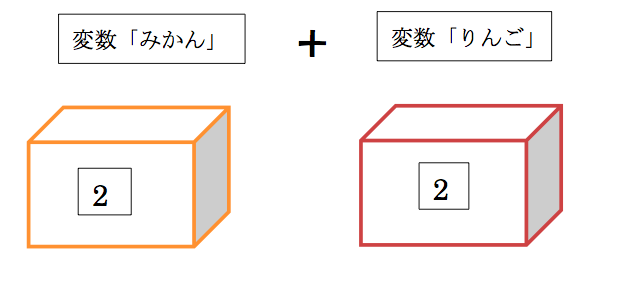

# <ruby><rb>第<rb><rt>だい</rt></ruby>４<ruby><rb>章<rb><rt>しょう</rt></ruby>：「<ruby><rb>変数<rb><rt>へんすう</rt></ruby>」ってなんだろう？

この<ruby><rb>章<rb><rt>しょう</rt></ruby>で<ruby><rb>学<rb><rt>まな</rt></ruby>べることは...

・<ruby><rb>変数<rb><rt>へんすう</rt></ruby>とは<ruby><rb>何<rb><rt>なに</rt></ruby>か<ruby><rb>身近<rb><rt>みぢか</rt></ruby>な<ruby><rb>例<rb><rt>たと</rt></ruby>えを<ruby><rb>用<rb><rt>もち</rt></ruby>いて<ruby><rb>お話<rb><rt>おはな</rt></ruby>しします。

・なぜ<ruby><rb>変数<rb><rt>へんすう</rt></ruby>というものが<ruby><rb>必要<rb><rt>ひつよう</rt></ruby>なのか<ruby><rb>分<rb><rt>わ</rt></ruby>かるようになります。

・<ruby><rb>変数<rb><rt>へんすう</rt></ruby>を<ruby><rb>使<rb><rt>つか</rt></ruby>って<ruby><rb>計算<rb><rt>けいさん</rt></ruby>をするプログラムが<ruby><rb>書<rb><rt>か</rt></ruby>けるようになります。

## まずはイメージをつかんでみよう！
#### <ruby><rb>例題<rb><rt>れいだい</rt></ruby>
<ruby><rb>太郎<rb><rt>たろう</rt></ruby><ruby><rb>君<rb><rt>くん</rt></ruby>はみかんとりんごを<ruby><rb>友達<rb><rt>ともだち</rt></ruby>からもらったので、<ruby><rb>箱<rb><rt>はこ</rt></ruby>を<ruby><rb>２<rb><rt>ふた</rt></ruby>つ<ruby><rb>用意<rb><rt>ようい</rt></ruby>しました。

もらったみかんとりんごを<ruby><rb>全部<rb><rt>ぜんぶ</rt></ruby><ruby><rb>手<rb><rt>て</rt></ruby>に<ruby><rb>持<rb><rt>も</rt></ruby>つのは<ruby><rb>大変<rb><rt>たいへん</rt></ruby>なので、
<ruby><rb>箱<rb><rt>はこ</rt></ruby>に<ruby><rb>一旦<rb><rt>いったん</rt></ruby><ruby><rb>入<rb><rt>い</rt></ruby>れて<ruby><rb>数<rb><rt>かず</rt></ruby>を<ruby><rb>数<rb><rt>かぞ</rt></ruby>える<ruby><rb>事<rb><rt>こと</rt></ruby>にしました。

「みかん」という<ruby><rb>箱<rb><rt>はこ</rt></ruby>にみかんを３<ruby><rb>個<rb><rt>こ</rt></ruby><ruby><rb>入<rb><rt>い</rt></ruby>れ、
「りんご」という<ruby><rb>箱<rb><rt>はこ</rt></ruby>にりんごを２<ruby><rb>個<rb><rt>こ</rt></ruby><ruby><rb>入<rb><rt>い</rt></ruby>れました。　

しかし、<ruby><rb>太郎<rb><rt>たろう</rt></ruby><ruby><rb>君<rb><rt>くん</rt></ruby>はみかんを<ruby><rb>１<rb><rt>ひと</rt></ruby>つ<ruby><rb>食<rb><rt>た</rt></ruby>べてしまいました。

みかんの<ruby><rb>箱<rb><rt>はこ</rt></ruby>のみかんとりんごの<ruby><rb>箱<rb><rt>はこ</rt></ruby>のりんごを<ruby><rb>全部<rb><rt>ぜんぶ</rt></ruby>あわせると
<ruby><rb>今<rb><rt>こん</rt></ruby><ruby><rb>現在<rb><rt>げんざい</rt></ruby>、<ruby><rb>合計<rb><rt>ごうけい</rt></ruby>何<ruby><rb>個<rb><rt>こ</rt></ruby>でしょうか？

#### <ruby><rb>答<rb><rt>こた</rt></ruby>え：４<ruby><rb>個<rb><rt>こ</rt></ruby>

### <ruby><rb>変数<rb><rt>へんすう</rt></ruby>について<ruby><rb>上<rb><rt>うえ</rt></ruby>の<ruby><rb>例<rb><rt>れい</rt></ruby>で<ruby><rb>考<rb><rt>かんが</rt></ruby>えてみよう!
この<ruby><rb>例<rb><rt>れい</rt></ruby>について、プログラミングとどう<ruby><rb>関連<rb><rt>かんれん</rt></ruby>するか<ruby><rb>見<rb><rt>み</rt></ruby>ていこう！

<ruby><rb>最初<rb><rt>さいしょ</rt></ruby>はみかんの<ruby><rb>箱<rb><rt>はこ</rt></ruby>には３<ruby><rb>個<rb><rt>こ</rt></ruby>、りんごの<ruby><rb>箱<rb><rt>はこ</rt></ruby>には２<ruby><rb>個<rb><rt>こ</rt></ruby><ruby><rb>入<rb><rt>はい</rt></ruby>っているね。 
プログラミングの<ruby><rb>世界<rb><rt>せかい</rt></ruby>ではこの<ruby><rb>箱<rb><rt>はこ</rt></ruby>のことを「<ruby><rb>変数<rb><rt>へんすう</rt></ruby>」と<ruby><rb>言<rb><rt>い</rt></ruby>うよ。

もらったみかんとりんごをずっと<ruby><rb>手<rb><rt>て</rt></ruby>に<ruby><rb>持<rb><rt>も</rt></ruby>っていては 
<ruby><rb>他<rb><rt>た</rt></ruby>の<ruby><rb>事<rb><rt>こと</rt></ruby>が<ruby><rb>出来<rb><rt>でき</rt></ruby>なくて<ruby><rb>不便<rb><rt>ふべん</rt></ruby>なので<ruby><rb>一旦<rb><rt>いったん</rt></ruby><ruby><rb>箱<rb><rt>はこ</rt></ruby>にしまうよね。 
プログラミングでも<ruby><rb>同<rb><rt>おな</rt></ruby>じように<ruby><rb>変数<rb><rt>へんすう</rt></ruby>にものをしまうんだ。

<ruby><rb>現実<rb><rt>げんじつ</rt></ruby>には、みかんそのものを<ruby><rb>箱<rb><rt>はこ</rt></ruby>に<ruby><rb>入<rb><rt>い</rt></ruby>れているけどプログラミングは
パソコン<ruby><rb>上<rb><rt>じょう</rt></ruby>で<ruby><rb>行<rb><rt>おこな</rt></ruby>うからみかんを<ruby><rb>箱<rb><rt>はこ</rt></ruby>に<ruby><rb>入<rb><rt>い</rt></ruby>れる<ruby><rb>事<rb><rt>こと</rt></ruby>はできないんだ。

だから、「みかんはX<ruby><rb>個<rb><rt>こ</rt></ruby>あるよ」という”<ruby><rb>数字<rb><rt>すうじ</rt></ruby>”を<ruby><rb>変数<rb><rt>へんすう</rt></ruby>に<ruby><rb>入<rb><rt>い</rt></ruby>れるんだ。

<ruby><rb>箱<rb><rt>はこ</rt></ruby>の<ruby><rb>名前<rb><rt>なまえ</rt></ruby>はわたしたちが<ruby><rb>好<rb><rt>す</rt></ruby>きな<ruby><rb>名前<rb><rt>なまえ</rt></ruby>に<ruby><rb>決<rb><rt>き</rt></ruby>めることができるよ。  
<ruby><rb>今回<rb><rt>こんかい</rt></ruby>は、「みかん」「りんご」という<ruby><rb>箱<rb><rt>はこ</rt></ruby>にしてみよう。

みかんの<ruby><rb>箱<rb><rt>はこ</rt></ruby>にみかんを<ruby><rb>３<rb><rt>みっ</rt></ruby>つ<ruby><rb>入<rb><rt>い</rt></ruby>れる<ruby><rb>式<rb><rt>しき</rt></ruby>はプログラングでは  
”みかん＝３”
となるんだ。

ここでの「＝」は「<ruby><rb>同<rb><rt>おな</rt></ruby>じだよ」という<ruby><rb>意味<rb><rt>いみ</rt></ruby>ではなく、 
“<ruby><rb>変数<rb><rt>へんすう</rt></ruby>「みかん」に「３」という<ruby><rb>数字<rb><rt>すうじ</rt></ruby>を<ruby><rb>入<rb><rt>い</rt></ruby>れるよ“という<ruby><rb>意味<rb><rt>いみ</rt></ruby>になるよ。

これで<ruby><rb>変数<rb><rt>へんすう</rt></ruby>「みかん」の<ruby><rb>中身<rb><rt>なかみ</rt></ruby>は「３」だから、
　　　　　
「３」　と　　　は<ruby><rb>同<rb><rt>おな</rt></ruby>じものとして<ruby><rb>考<rb><rt>かんが</rt></ruby>えることが<ruby><rb>出来<rb><rt>でき</rt></ruby>るんだよ。

<ruby><rb>同<rb><rt>おな</rt></ruby>じように、
りんご=2
とすると、<ruby><rb>変数<rb><rt>へんすう</rt></ruby>りんごに「2」を<ruby><rb>入<rb><rt>い</rt></ruby>れられるよ。

みかんを<ruby><rb>食<rb><rt>た</rt></ruby>べると<ruby><rb>箱<rb><rt>はこ</rt></ruby>からみかんが<ruby><rb>減<rb><rt>へ</rt></ruby>るように、<ruby><rb>変数<rb><rt>へんすう</rt></ruby>の<ruby><rb>中身<rb><rt>なかみ</rt></ruby>も<ruby><rb>変<rb><rt>か</rt></ruby>わっていくんだ。

さっきみたいに、みかんの<ruby><rb>箱<rb><rt>はこ</rt></ruby>からみかんが１<ruby><rb>個<rb><rt>こ</rt></ruby><ruby><rb>減<rb><rt>へ</rt></ruby>ったときは、 
プログラミングでは、 
みかん=みかん-1 
という<ruby><rb>式<rb><rt>しき</rt></ruby>であらわせるよ。

これをすると、”<ruby><rb>変数<rb><rt>へんすう</rt></ruby>「みかん」-１”  
すなわち”３－１”の<ruby><rb>結果<rb><rt>けっか</rt></ruby>の
“２”が<ruby><rb>新<rb><rt>あたら</rt></ruby>しい<ruby><rb>変数<rb><rt>へんすう</rt></ruby>「みかん」の<ruby><rb>中身<rb><rt>なかみ</rt></ruby>になるね。

<ruby><rb>最後<rb><rt>さいご</rt></ruby>に<ruby><rb>箱<rb><rt>はこ</rt></ruby>の<ruby><rb>中身<rb><rt>なかみ</rt></ruby>を<ruby><rb>足し算<rb><rt>たしざん</rt></ruby>してみよう！

みんなが<ruby><rb>実際<rb><rt>じっさい</rt></ruby>に<ruby><rb>数<rb><rt>かず</rt></ruby>を<ruby><rb>数<rb><rt>かぞ</rt></ruby>える<ruby><rb>時<rb><rt>とき</rt></ruby>は、 
“（みかんの<ruby><rb>箱<rb><rt>はこ</rt></ruby>の）２<ruby><rb>個<rb><rt>こ</rt></ruby><ruby><rb>＋<rb><rt>たす</rt></ruby>（リンゴの<ruby><rb>箱<rb><rt>はこ</rt></ruby>の）２<ruby><rb>個<rb><rt>こ</rt></ruby>”
というように  <ruby><rb>数字<rb><rt>すうじ</rt></ruby>で<ruby><rb>計算<rb><rt>けいさん</rt></ruby>するよね。

でも、プログラミングでは、 
“<ruby><rb>変数<rb><rt>へんすう</rt></ruby>「みかん」<ruby><rb>＋<rb><rt>たす</rt></ruby><ruby><rb>変数<rb><rt>へんすう</rt></ruby>「りんご」”というように 
<ruby><rb>変数<rb><rt>へんすう</rt></ruby><ruby><rb>同士<rb><rt>どうし</rt></ruby>を<ruby><rb>足し算<rb><rt>たしざん</rt></ruby>しても<ruby><rb>中身<rb><rt>なかみ</rt></ruby>の<ruby><rb>数字<rb><rt>すうじ</rt></ruby>を<ruby><rb>計算<rb><rt>けいさん</rt></ruby>してくれて<ruby><rb>同<rb><rt>おな</rt></ruby>じ<ruby><rb>結果<rb><rt>けっか</rt></ruby>になるよ。

をプログラミングで<ruby><rb>表<rb><rt>あらわ</rt></ruby>すと・・・

と<ruby><rb>表<rb><rt>あらわ</rt></ruby>せるんだ。

<ruby><rb>今<rb><rt>いま</rt></ruby>の<ruby><rb>例<rb><rt>れい</rt></ruby>を<ruby><rb>実際<rb><rt>じっさい</rt></ruby>にプログラミングを<ruby><rb>使<rb><rt>つか</rt></ruby>って<ruby><rb>自分<rb><rt>じぶん</rt></ruby>で<ruby><rb>書<rb><rt>か</rt></ruby>いてみよう。

<ruby><rb>今<rb><rt>いま</rt></ruby>の<ruby><rb>話<rb><rt>はなし</rt></ruby>では、<ruby><rb>変数<rb><rt>へんすう</rt></ruby>の<ruby><rb>名前<rb><rt>なまえ</rt></ruby>を<ruby><rb>分<rb><rt>わ</rt></ruby>かりやすいように「みかん」とか「りんご」とか
ひらがなの<ruby><rb>名前<rb><rt>なまえ</rt></ruby>を<ruby><rb>使<rb><rt>つか</rt></ruby>っていたけど、<ruby><rb>実際<rb><rt>じっさい</rt></ruby>のプログラミングのコードではひらがなを<ruby><rb>用<rb><rt>もち</rt></ruby>いることはできないんだ。

<ruby><rb>変数<rb><rt>へんすう</rt></ruby>は<ruby><rb>自分<rb><rt>じぶん</rt></ruby>で<ruby><rb>好<rb><rt>す</rt></ruby>きな<ruby><rb>名前<rb><rt>なまえ</rt></ruby>をつけることができるけど、
aとかbとかではなく<ruby><rb>後<rb><rt>のち</rt></ruby>で<ruby><rb>見<rb><rt>み</rt></ruby>て<ruby><rb>分<rb><rt>わ</rt></ruby>かるようにすることが<ruby><rb>多<rb><rt>おお</rt></ruby>いんだ。

だから、<ruby><rb>今回<rb><rt>こんかい</rt></ruby>は<ruby><rb>箱<rb><rt>はこ</rt></ruby>の<ruby><rb>名前<rb><rt>なまえ</rt></ruby>はmikan,orangeとするよ。

<ruby><rb>次<rb><rt>つぎ</rt></ruby>にその<ruby><rb>箱<rb><rt>はこ</rt></ruby>の<ruby><rb>中<rb><rt>なか</rt></ruby>に<ruby><rb>数字<rb><rt>すうじ</rt></ruby>を<ruby><rb>入<rb><rt>い</rt></ruby>れよう。
<ruby><rb>最初<rb><rt>さいしょ</rt></ruby>はみかんが３<ruby><rb>個<rb><rt>こ</rt></ruby>りんごが２<ruby><rb>個<rb><rt>こ</rt></ruby>だったから<ruby><rb>次<rb><rt>つぎ</rt></ruby>のようになるね。  
mikan=3  
ringo=2

<ruby><rb>次<rb><rt>つぎ</rt></ruby>は、もらったみかんが１<ruby><rb>個<rb><rt>こ</rt></ruby><ruby><rb>減<rb><rt>へ</rt></ruby>ったからそれについて<ruby><rb>書<rb><rt>か</rt></ruby>いてみよう。
<ruby><rb>変数<rb><rt>へんすう</rt></ruby>mikanにmikan-1の<ruby><rb>結果<rb><rt>けっか</rt></ruby>を<ruby><rb>入<rb><rt>い</rt></ruby>れるから、<ruby><rb>次<rb><rt>つぎ</rt></ruby>のようになるね。  
mikan=mikan-1

<ruby><rb>最後<rb><rt>さいご</rt></ruby>に、mikanとringoの<ruby><rb>足し算<rb><rt>たしざん</rt></ruby>の<ruby><rb>結果<rb><rt>けっか</rt></ruby>を<ruby><rb>表示<rb><rt>ひょうじ</rt></ruby>しよう。  
print mikan+ringo

printについては<ruby><rb>第<rb><rt>だい</rt></ruby>２<ruby><rb>章<rb><rt>しょう</rt></ruby>で<ruby><rb>話<rb><rt>はな</rt></ruby>したね。<ruby><rb>忘<rb><rt>わす</rt></ruby>れていたら２<ruby><rb>章<rb><rt>しょう</rt></ruby>を<ruby><rb>振り返<rb><rt>ふりかえ</rt></ruby>ってみよう。

コードの<ruby><rb>書き方<rb><rt>かきかた</rt></ruby>はこんなながれになるよ。  
つぎはみんなでここに<ruby><rb>全部<rb><rt>ぜんぶ</rt></ruby>まとまったコードを<ruby><rb>書<rb><rt>か</rt></ruby>いてみよう！
<textarea>
</textarea>

4と<ruby><rb>表示<rb><rt>ひょうじ</rt></ruby>されていれば<ruby><rb>正<rb><rt>ただ</rt></ruby>しくプログラムが<ruby><rb>書<rb><rt>か</rt></ruby>けているよ。

ところで、さっき<ruby><rb>実際<rb><rt>じっさい</rt></ruby>のプログラミングには<ruby><rb>変数<rb><rt>へんすう</rt></ruby>の<ruby><rb>名前<rb><rt>なまえ</rt></ruby>はひらがなが<ruby><rb>使<rb><rt>つか</rt></ruby>えないといったけど、<ruby><rb>変数<rb><rt>へんすう</rt></ruby>の<ruby><rb>名前<rb><rt>なまえ</rt></ruby>の<ruby><rb>付け方<rb><rt>つけかた</rt></ruby>については<ruby><rb>以下<rb><rt>いか</rt></ruby>のようなルールがあるよ。 

・１<ruby><rb>文字<rb><rt>もじ</rt></ruby><ruby><rb>目<rb><rt>め</rt></ruby>は<ruby><rb>英<rb><rt>えい</rt></ruby><ruby><rb>文字<rb><rt>もじ</rt></ruby>かアンダーバー 
・2<ruby><rb>文字<rb><rt>もじ</rt></ruby><ruby><rb>目<rb><rt>め</rt></ruby><ruby><rb>移行<rb><rt>いこう</rt></ruby>は<ruby><rb>英<rb><rt>えい</rt></ruby><ruby><rb>数<rb><rt>すう</rt></ruby><ruby><rb>文字<rb><rt>もじ</rt></ruby>、アンダーバー 
・<ruby><rb>大文字<rb><rt>おおもじ</rt></ruby>と<ruby><rb>小文字<rb><rt>こもじ</rt></ruby>は<ruby><rb>区別<rb><rt>くべつ</rt></ruby>される

<ruby><rb>大文字<rb><rt>おおもじ</rt></ruby>と<ruby><rb>小文字<rb><rt>こもじ</rt></ruby>を<ruby><rb>区別<rb><rt>くべつ</rt></ruby>するというのは、<ruby><rb>変数<rb><rt>へんすう</rt></ruby>「Abc」と<ruby><rb>変数<rb><rt>へんすう</rt></ruby>「abc」
は<ruby><rb>違<rb><rt>ちが</rt></ruby>う<ruby><rb>箱<rb><rt>はこ</rt></ruby>になるということだよ。

## <ruby><rb>練習<rb><rt>れんしゅう</rt></ruby><ruby><rb>問題<rb><rt>もんだい</rt></ruby>：<ruby><rb>実際<rb><rt>じっさい</rt></ruby>に<ruby><rb>自分<rb><rt>じぶん</rt></ruby>で<ruby><rb>書<rb><rt>か</rt></ruby>いてみよう!
#### <ruby><rb>問題<rb><rt>もんだい</rt></ruby>：
<ruby><rb>変数<rb><rt>へんすう</rt></ruby>mikanに３、<ruby><rb>変数<rb><rt>へんすう</rt></ruby>ringoに２を<ruby><rb>代入<rb><rt>だいにゅう</rt></ruby>して、mikanとringoを<ruby><rb>足し算<rb><rt>たしざん</rt></ruby>してその<ruby><rb>結果<rb><rt>けっか</rt></ruby>を<ruby><rb>出力<rb><rt>しゅつりょく</rt></ruby>してください。
<textarea>
</textarea>

#### <ruby><rb>解答<rb><rt>かいとう</rt></ruby>:
mikan=3
ringo=2
printmikan+ringo

####<ruby><rb>問題<rb><rt>もんだい</rt></ruby>：
<ruby><rb>変数<rb><rt>へんすう</rt></ruby>mikanに10、<ruby><rb>変数<rb><rt>へんすう</rt></ruby>ringoに20を<ruby><rb>代入<rb><rt>だいにゅう</rt></ruby>して、mikanとringoを<ruby><rb>足し算<rb><rt>たしざん</rt></ruby>してその<ruby><rb>結果<rb><rt>けっか</rt></ruby>を<ruby><rb>出力<rb><rt>しゅつりょく</rt></ruby>してください。
<textarea>
</textarea>

#### <ruby><rb>解答<rb><rt>かいとう</rt></ruby>:
mikan=10
ringo=20
printmikan+ringo

#### <ruby><rb>問題<rb><rt>もんだい</rt></ruby>：
<ruby><rb>変数<rb><rt>へんすう</rt></ruby>mikanに10、<ruby><rb>変数<rb><rt>へんすう</rt></ruby>ringoに20を<ruby><rb>代入<rb><rt>だいにゅう</rt></ruby>して、mikanとringoを<ruby><rb>かけ算<rb><rt>かけざん</rt></ruby>してその<ruby><rb>結果<rb><rt>けっか</rt></ruby>を<ruby><rb>出力<rb><rt>しゅつりょく</rt></ruby>してください。
<textarea>
</textarea>

#### <ruby><rb>解答<rb><rt>かいとう</rt></ruby>:
mikan=10
ringo=20
printmikan*ringo
